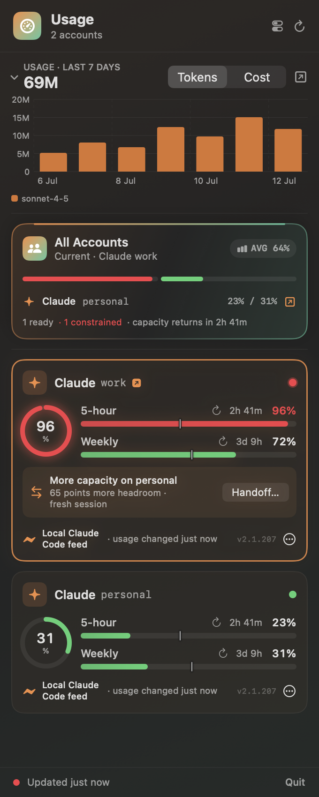
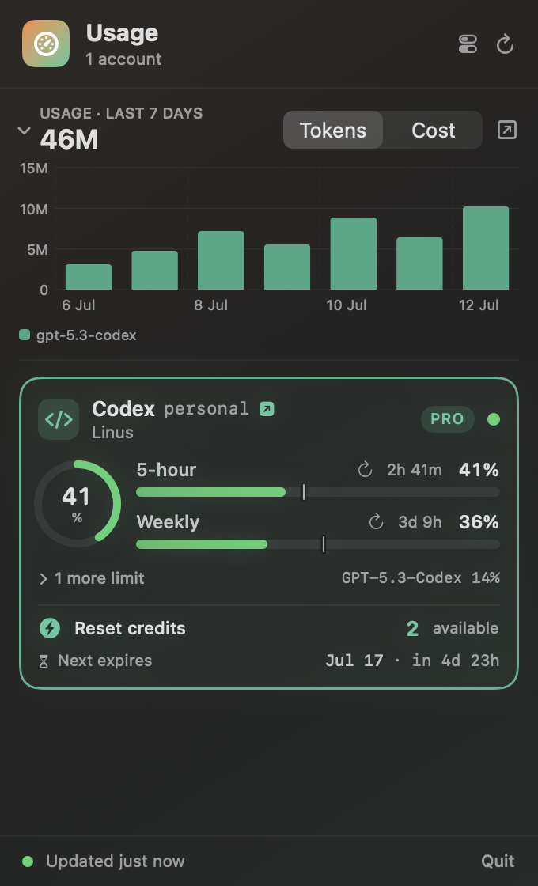

# Claudex

A polished macOS menu-bar app that shows **Claude** and **Codex** usage at a glance,
across **multiple logins**, with rate-limit windows, reset countdowns, and Codex reset
credits + expirations.

Claudex is open source under the MIT license.

<p align="center">
  
</p>

> Account names in the screenshot are placeholders.

<details>
<summary>More demo states</summary>
<table>
  <tr>
    <th>Limit-aware handoff</th>
    <th>Single account</th>
  </tr>
  <tr>
    <td></td>
    <td></td>
  </tr>
</table>
</details>

## What it shows

- The active account's usage—or normalized portfolio pressure when no account can be
  mapped—right in the menu bar (colour-coded green → amber → red).
- Per-account cards with a usage ring and the primary windows:
  - **Claude** — 5-hour + weekly windows received locally from Claude Code.
  - **Codex** — server-reported primary/secondary windows, per-model additional limits,
    and **reset credits** with how many are available and when the next one expires.
- Provider-reported plan/name metadata where available, and a status dot.
- A **"now" marker** on each usage bar showing how far through the reset window you are
  *in time* — so you can read your pace at a glance: green short of the tick means you're
  using slower than the clock; green past it means you're burning faster.
- Claude updates after normal Claude Code responses with no Claudex network request;
  Codex refreshes every 5 minutes. Refresh-on-open and manual refresh remain available.
- An optional usage-history chart reads an already-installed `ccusage` executable;
  Claudex never invokes `npx` or a package manager to download it automatically.
- An **All Accounts** portfolio shows normalized pressure, the healthiest Claude and
  Codex login, and becomes the menu-bar fallback when the active account cannot be mapped.
- When an account reaches warning/critical pressure (or is rate limited), Claudex can
  **handoff** to a healthier login of the same provider in a fresh terminal session while
  preserving the current project directory when it can be detected.

It uses the same local account slots as your CLIs — no separate sign-in. Nothing is
uploaded. Claude data is passed from Claude Code through a local, opt-in status-line
helper; only Codex uses its read-only usage endpoint.

### Frontmost account tracking

When a **Claude or Codex session is the frontmost window**, the menu bar switches from
the portfolio to *that account's* usage — a provider-tinted gauge plus its two headline
window percentages (e.g. `35% / 41%`), and the matching card is highlighted in the
panel. Switch to a window running a different account and it updates within ~2s. When
nothing detectable is frontmost, it falls back to normalized portfolio pressure.

Two kinds of frontmost session are recognised (all local, only your own processes):

- **Terminal sessions** (Terminal or iTerm2): the frontmost tab's tty (via Apple Events)
  → the `claude`/`codex` process on it → its `CLAUDE_CONFIG_DIR` / `CODEX_HOME` env → the
  account. On first use macOS asks to let Claudex control Terminal/iTerm — click **Allow**.
- **Desktop apps**: Codex can be matched to its active local account. Claude.app is
  detected as Claude, but the passive feed intentionally carries no account UUID, so
  multi-account Claude.app windows fall back to portfolio usage rather than guessing.

VS Code's integrated terminal has no scriptable tty and no on-disk signal, so it falls
back to the portfolio.

## Install

### Homebrew

```sh
brew install everlof/tap/claudex
```

This builds Claudex from source and installs `Claudex.app` into your Homebrew prefix.
Launch it with:

```sh
open "$(brew --prefix)/opt/claudex/Claudex.app"
```

To have it start automatically at login, add that `.app` to **System Settings → General →
Login Items**, or link it into `/Applications`:

```sh
ln -sf "$(brew --prefix)/opt/claudex/Claudex.app" /Applications/Claudex.app
```

Claudex does not read Claude's Keychain item. The first time you connect a Claude account,
the app explains the local settings change, restore behavior, and retained fields before
applying it.

### Direct download

The [latest GitHub release](https://github.com/everlof/claudex/releases/latest) includes
a universal `Claudex.app` for Apple Silicon and Intel. Public release bundles are
Developer ID signed, notarized by Apple, stapled, and verified with Gatekeeper.

### From source

```sh
git clone https://github.com/everlof/claudex.git
cd claudex
./build-app.sh            # builds Claudex.app (release) and code-signs it
open ./Claudex.app
```

Requires the Swift 6 toolchain (Xcode 16+ or the Swift toolchain) on macOS 14+.

The app lives in the menu bar only (no Dock icon). Quit from the panel's **Quit** button.

## Multiple logins

Both tools support multiple accounts via a per-account config directory, and Claudex
discovers them automatically.

### Claude

Claude Code reads its config dir from `CLAUDE_CONFIG_DIR` (default `~/.claude`). Claudex
finds these local config slots without querying the Keychain:

- the default `~/.claude`, and
- any `~/.claude-*` directory that contains `.claude.json` or `settings.json`.

Add another login by pointing `CLAUDE_CONFIG_DIR` at a new dir and signing in there. The
account is labelled by the directory name (minus the leading dot):

```sh
alias claude-work='CLAUDE_CONFIG_DIR="$HOME/.claude-work" claude'   # → "claude-work"
claude-work   # sign in once under this account
```

### Codex

Codex reads its home from `CODEX_HOME` (default `~/.codex`). Add a second login the same
way, then sign in once under it:

```sh
alias codexwork='CODEX_HOME="$HOME/.codex-work" codex'
codexwork login          # sign in for this account
```

Claudex finds the default `~/.codex` plus any `~/.codex-*` home that has an `auth.json`,
and labels each by the account name/email from its token — so several Codex logins are
easy to tell apart.

## Claude's local usage feed

This integration uses Claude Code's documented
[`rate_limits` status-line feed](https://code.claude.com/docs/en/statusline#rate-limit-usage),
available to Claude.ai Pro/Max accounts running Claude Code 2.1.80 or newer. Claude
accounts begin disconnected; choose **Review & Connect…** on an account card.
Claudex explains the complete operation, then adds a small command to that config slot's
`settings.json`. Claude Code sends the helper its documented status-line JSON after normal
responses. The helper retains only:

- five-hour and weekly percentages,
- their reset timestamps,
- the last-changed time, and
- the Claude Code version.

A separate minimal health heartbeat keeps only its received time, Claude Code version,
and whether rate-limit fields were present. This lets the UI distinguish “helper never
ran” from “helper ran but this login did not provide subscription limits.”

It discards the raw payload, including credentials, prompts/responses, working directory,
session ID, and transcript path. Claudex does not call Anthropic or read Claude's Keychain
token. The cache stays in `~/Library/Application Support/Claudex/` with owner-only
permissions.

To make disconnect reversible, setup also keeps an owner-only restore record containing
the Claude config path and the exact original `statusLine` object. If that command already
contained paths or secrets, they remain in this private backup and forwarding file; they
are never added to diagnostics or uploaded.

If you already use a status line, Claudex chains it with the original stdin and preserves
its stdout, stderr, and exit status. Disconnect restores the exact `statusLine` value found
at connect time. If the setting changed afterward, Claudex refuses to overwrite it.

The feed appears after that account's first Claude response. Team/API/other authentication
modes may not provide these subscription fields. Claude Code's normal
workspace trust must allow status-line commands. When no session is active, Claudex shows
the last changed snapshot and marks it stale after six hours or after a displayed reset
passes.

Claudex copies the signed helper to the stable owner-only path
`~/Library/Application Support/Claudex/bin/`, so app and Homebrew upgrades do not break the
feed. Disconnect integrations before permanently uninstalling Claudex so their original
status lines are restored and the helper stops writing unused caches.

`build-app.sh` signs with your first available *Apple Development* identity automatically
so macOS automation permissions remain stable across rebuilds; override it with:

```sh
CLAUDEX_SIGN_ID="Apple Development: Your Name (TEAMID)" ./build-app.sh
```

If no signing identity is available it falls back to an ad-hoc signature.

Diagnostics are also explicit: **Settings → Preview diagnostics…** shows the entire
allowlisted report before the user can copy it. It contains app/build and macOS versions,
a binary fingerprint, aggregate provider counts, ordinal integration states, window kinds,
and active Codex backoff—not identity, paths, credentials, sessions, or content. Claudex
never uploads the report.

## Design notes

The codebase is deliberately **type-driven** — illegal states are unrepresentable:

- `Provider` and `Severity` are exhaustive enums; every `switch` must handle every case.
- Network-backed usage uses a typed `LoadState`; Claude's independent local-feed setup
  uses `ClaudeIntegrationState`, so consent/repair state cannot be confused with data state.
- Wire (`Codable`) types are kept strictly separate from the presentational domain types;
  raw tokens never leave the fetch layer.
- Strict Swift 6 concurrency is on — it largely "just works once it compiles".

### Layout

```
Sources/Claudex/
  Model/        Domain.swift (enums/structs), WireTypes.swift (Codable DTOs)
  Services/     CredentialStore.swift (Claude config + Codex auth discovery)
                ClaudeStatusCache.swift / ClaudeStatusLineInstaller.swift
                UsageService.swift    (Codex fetcher → domain)
                UsageStore.swift      (local Claude feed + Codex refresh/backoff)
  UI/           Components, AccountCard, MenuContent, Formatting
  ClaudexApp.swift  (NSStatusItem + popover host)

Sources/ClaudexStatusBridge/
  main.swift        (minimal status-line payload filter/cache + command forwarding)
```

### Reproducible screenshots

Named demo scenarios provide deterministic accounts, limits, reset times, handoff state,
and usage history without reading real credentials. Regenerate every PNG with:

```sh
./scripts/capture-screenshots.sh
```

This produces `overview`, `handoff`, and `single-account` variants in `docs/screenshots/`
and updates the primary `docs/screenshot.png` from the overview fixture. Capture happens
inside the app, so macOS Screen Recording permission is not required.

## Project docs

- [Privacy](PRIVACY.md)
- [Changelog](CHANGELOG.md)
- [Release process](RELEASING.md)
