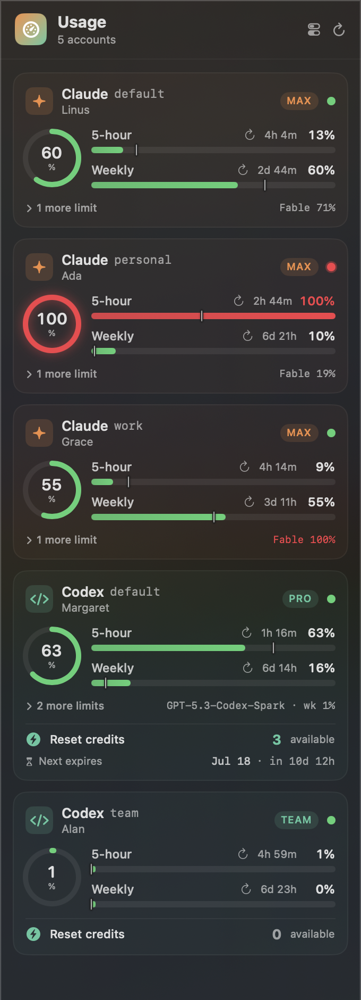

# Claudex

A polished macOS menu-bar app that shows **Claude** and **Codex** usage at a glance,
across **multiple logins**, with rate-limit windows, reset countdowns, and Codex reset
credits + expirations.

<p align="center">
  
</p>

> Account names in the screenshot are placeholders.

## What it shows

- The **peak usage %** across every account, right in the menu bar (colour-coded green →
  amber → red).
- Per-account cards with a usage ring and the primary windows:
  - **Claude** — 5-hour + weekly windows, plus any scoped/model limits (e.g. Fable).
  - **Codex** — 5-hour + weekly windows, per-model additional limits, and **reset
    credits** with how many are available and when the next one expires.
- Each account's plan (Max / Pro), display name, and a status dot.
- A **"now" marker** on each usage bar showing how far through the reset window you are
  *in time* — so you can read your pace at a glance: green short of the tick means you're
  using slower than the clock; green past it means you're burning faster.
- Auto-refreshes every 5 minutes; refresh-on-open (throttled) and a manual refresh button.

It reads the same logins your CLIs already use — no separate sign-in. Nothing is uploaded;
it only calls the same read-only usage endpoints the official tools use.

### Frontmost account tracking

When a **Claude or Codex session is the frontmost window**, the menu bar switches from
the global peak to *that account's* usage — a provider-tinted gauge plus its **5-hour /
weekly** percentages (e.g. `35% / 41%`), and the matching card is highlighted in the
panel. Switch to a window running a different account and it updates within ~2s. When
nothing detectable is frontmost, it falls back to the global peak.

Two kinds of frontmost session are recognised (all local, only your own processes):

- **Terminal sessions** (Terminal or iTerm2): the frontmost tab's tty (via Apple Events)
  → the `claude`/`codex` process on it → its `CLAUDE_CONFIG_DIR` / `CODEX_HOME` env → the
  account. On first use macOS asks to let Claudex control Terminal/iTerm — click **Allow**.
- **Desktop apps** (the **Codex** and **Claude** apps): these have no tty, so Claudex
  reads the app's *active login* from its own on-disk state and matches it to the account.

VS Code's integrated terminal has no scriptable tty and no on-disk signal, so it falls
back to the peak.

## Install

### Homebrew

```sh
brew install everlof/tap/claudex
```

This builds Claudex from source and installs `Claudex.app` into your Homebrew prefix.
Launch it with:

```sh
open "$(brew --prefix)/opt/claudex/Claudex.app"
```

To have it start automatically at login, add that `.app` to **System Settings → General →
Login Items**, or link it into `/Applications`:

```sh
ln -sf "$(brew --prefix)/opt/claudex/Claudex.app" /Applications/Claudex.app
```

Because it's built locally and ad-hoc signed, macOS asks on first launch to allow the app
to read the keychain (your Claude logins). Click **Always Allow**.

### From source

```sh
git clone https://github.com/everlof/claudex.git
cd claudex
./build-app.sh            # builds Claudex.app (release) and code-signs it
open ./Claudex.app
```

Requires the Swift 6 toolchain (Xcode 16+ or the Swift toolchain) on macOS 14+.

The app lives in the menu bar only (no Dock icon). Quit from the panel's **Quit** button.

## Multiple logins

Both tools support multiple accounts via a per-account config directory, and Claudex
discovers them automatically.

### Claude

Claude Code reads its config dir from `CLAUDE_CONFIG_DIR` (default `~/.claude`). Each
config dir has its own login stored in the macOS keychain. Claudex finds:

- the default `~/.claude`, and
- any `~/.claude-*` directory that contains a `.claude.json`.

Add another login by pointing `CLAUDE_CONFIG_DIR` at a new dir and signing in there. The
account is labelled by the directory name (minus the leading dot):

```sh
alias claude-work='CLAUDE_CONFIG_DIR="$HOME/.claude-work" claude'   # → "claude-work"
claude-work   # sign in once under this account
```

### Codex

Codex reads its home from `CODEX_HOME` (default `~/.codex`). Add a second login the same
way, then sign in once under it:

```sh
alias codexwork='CODEX_HOME="$HOME/.codex-work" codex'
codexwork login          # sign in for this account
```

Claudex finds the default `~/.codex` plus any `~/.codex-*` home that has an `auth.json`,
and labels each by the account name/email from its token — so several Codex logins are
easy to tell apart.

## The keychain prompt

Claude logins are stored in the macOS keychain, so the **first time** Claudex reads each
one, macOS asks for permission. Click **Always Allow** and it won't ask again.

If you click **Deny** (or dismiss the prompt), Claudex stops asking: automatic refreshes
skip that account, and its card shows **Keychain access denied** with a **Grant access…**
button. Clicking it — or the ⟳ refresh button — retries and re-shows the macOS prompt.

For "Always Allow" to *stick across rebuilds*, the app must keep a **stable code
signature**. `build-app.sh` signs with your first available *Apple Development* identity
automatically; override it with:

```sh
CLAUDEX_SIGN_ID="Apple Development: Your Name (TEAMID)" ./build-app.sh
```

If no signing identity is available it falls back to an ad-hoc signature — which works,
but changes every build, so the keychain will re-prompt after each rebuild.

Codex logins live in `~/.codex/auth.json` (a plain file), so they never prompt.

## Design notes

The codebase is deliberately **type-driven** — illegal states are unrepresentable:

- `Provider` and `Severity` are exhaustive enums; every `switch` must handle every case.
- Each account's lifecycle is a single `LoadState` enum (`idle` / `loading` / `loaded` /
  `failed`), so the UI can't render data that doesn't exist or forget the error path.
- Wire (`Codable`) types are kept strictly separate from the presentational domain types;
  raw tokens never leave the fetch layer.
- Strict Swift 6 concurrency is on — it largely "just works once it compiles".

### Layout

```
Sources/Claudex/
  Model/        Domain.swift (enums/structs), WireTypes.swift (Codable DTOs)
  Services/     CredentialStore.swift (keychain + auth.json discovery)
                UsageService.swift    (Claude + Codex fetchers → domain)
                UsageStore.swift      (@Observable store, 5-min refresh, backoff)
  UI/           Components, AccountCard, MenuContent, Formatting
  ClaudexApp.swift  (NSStatusItem + popover host)
```
